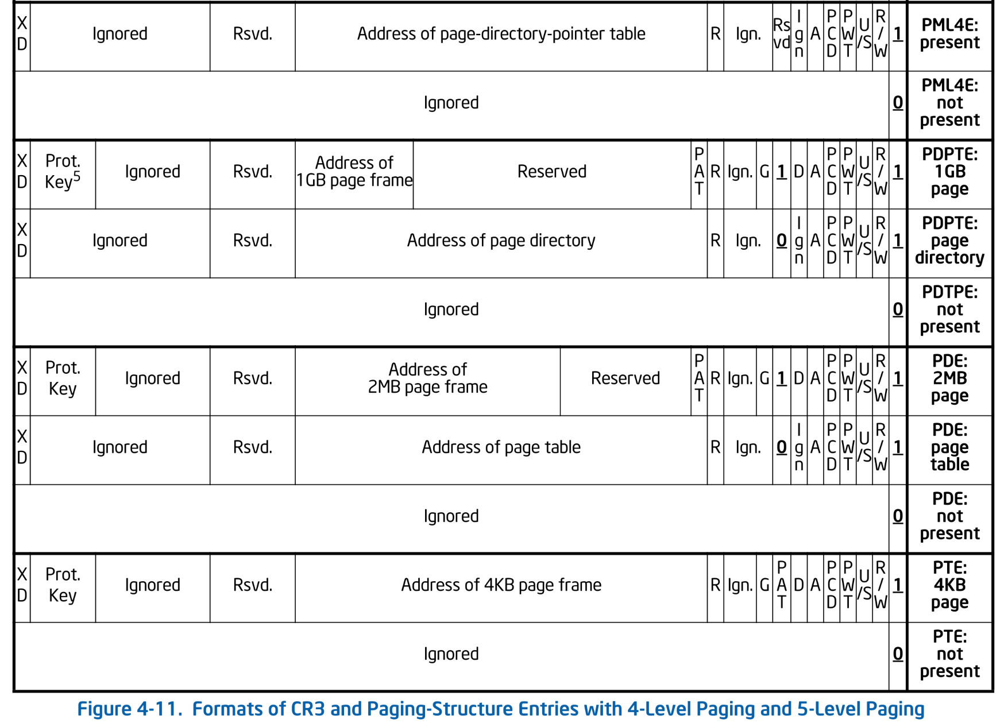
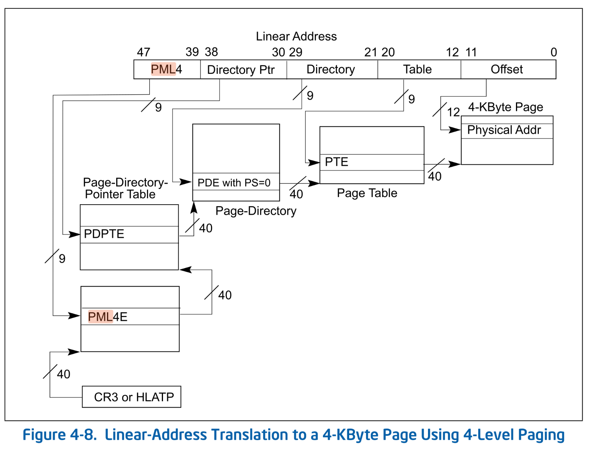

# 簡易版ページテーブル

前回で Ymir の ELF イメージをファイルかリードできるようになりました。
本当はそのままカーネルをロードしたいところでしたが、
そのためにはページテーブルを操作して ELF が要求する仮想アドレスをマップする必要があります。
ブートローダである Surtr がページテーブルを操作するのはその目的のためだけのため、
本チャプターでは必要最低限なページテーブルの操作を実装していきます。

## Table of Contents

<!-- toc -->

## arch ディレクトリの作成

ページテーブルの構造を始めとして、ページテーブルはアーキテクチャに大きく依存します。
本シリーズでは x64 以外をサポートしませんが、それでもアーキテクチャ依存のコードは階層を分けて書いていくことにします。

`arch` ディレクトリの中に `x86` ディレクトリを作成し、以下のような構造にします:

```sh
> tree ./surtr
./surtr
├── arch
│   └── x86
│       └── arch.zig
├── arch.zig
├── boot.zig
└── log.zig
```

- `arch.zig`: `boot.zig`から直接利用するファイル。
できる限りアーキ依存の概念を隠蔽できるようなAPIを提供し、`arch/`以下の不必要なAPIは参照できないようにします。
- `arch/x86/arch.zig`: x64 固有のAPIを export するルートファイル。

`/arch.zig` では以下のようにターゲットとなるアーキテクチャに応じて `arch` 以下のコードを export します:

```zig
// -- surtr/arch.zig --

const builtin = @import("builtin");
pub usingnamespace switch (builtin.target.cpu.arch) {
    .x86_64 => @import("arch/x86/arch.zig"),
    else => @compileError("Unsupported architecture."),
};
```

`builtin.target.cpu.arch` は `build.zig`の`cpu_arch`で指定したターゲットアーキテクチャです。
今回は `x86_64` で固定ですが、他のアーキにも対応するようにした場合ターゲットに応じて変化します。
コンパイル時に決定する値であるため、この`switch`文もコンパイル時に評価され、対応するアーキのルートファイルが export されます。

<div class="warning">
usingnamespace

[usingnamespace](https://ziglang.org/documentation/master/#usingnamespace) は、指定した構造体のフィールド全てを現在のスコープに持ってきてくれる機能です。
今回の場合、単純に `@import("arch/x86/arch.zig")` すると以下のように利用側では一段余計なフィールドを指定する必要があります:

```zig
// -- surtr/arch.zig --
pub const impl = @import("arch/x86/arch.zig");
// -- surtr/boot.zig --
const arch = @import("arch.zig");
arch.impl.someFunction();
```

`usingnamespace` を使うことで、この余計な一段階を省くことができるようになります:

```zig
// -- surtr/arch.zig --
pub usingnamespace @import("arch/x86/arch.zig");
// -- surtr/boot.zig --
const arch = @import("arch.zig");
arch.someFunction();
```

やや黒魔術的な見た目な機能ですが、`usingnamespace` を使って構造体内のフィールドを現在のファイルのトップレベルスコープに import するようなことはできないため安心してください:

```zig
usingnamespace @import("some.zig"); // someFunction() が定義されているファイル
someFunction(); // このようなことはできない
```

</div>

`arch/x86/arch.zig` はアーキ依存のコードに置いて `arch` 以外から利用したいファイルを定義します。
今回はページテーブルを実装したいため、 `arch/x86/page.zig` を作成したあと、
`arch/x86/arch.zig` から `page.zig` を export します。

```zig
// -- surtr/arch/x86/arch.zig --

pub const page = @import("page.zig");
```

これで `boot.zig` から x64 のページングに関する機能を利用できるようになりました。

## ページテーブルエントリ

ここから、ページテーブルの操作をできるようにしていきます。
そもそも、UEFI から Surtr に制御が移った時点で既に UEFI が 64bit モードに移行してくれており、
初期用のページテーブルを構築してくれています。
[gef](https://github.com/bata24/gef) の `vmmap` コマンドを使ってメモリマップを確認してみましょう。
`build.zig` で QEMU の起動コマンドとして `-s` を指定しているため、
ポート `1234` で GDB サーバにアタッチすることができます。
現在 Surtr は `main()` の最後に無限ループをするようになっているため、その間にGDBでアタッチします:

<details>
<summary>メモリマップの確認</summary>

```sh
gef> target remote:1234
gef> vmmap
--------------------------------------- Memory map ---------------------------------------
Virtual address start-end              Physical address start-end             Total size   Page size   Count  Flags
0x0000000000000000-0x0000000000200000  0x0000000000000000-0x0000000000200000  0x200000     0x200000    1      [RWX KERN ACCESSED DIRTY]
0x0000000000200000-0x0000000000800000  0x0000000000200000-0x0000000000800000  0x600000     0x200000    3      [RWX KERN ACCESSED]
0x0000000000800000-0x0000000000a00000  0x0000000000800000-0x0000000000a00000  0x200000     0x200000    1      [RWX KERN ACCESSED DIRTY]
0x0000000000a00000-0x000000001be00000  0x0000000000a00000-0x000000001be00000  0x1b400000   0x200000    218    [RWX KERN ACCESSED]
0x000000001be00000-0x000000001c000000  0x000000001be00000-0x000000001c000000  0x200000     0x200000    1      [RWX KERN ACCESSED DIRTY]
0x000000001c000000-0x000000001e200000  0x000000001c000000-0x000000001e200000  0x2200000    0x200000    17     [RWX KERN ACCESSED]
0x000000001e200000-0x000000001ee00000  0x000000001e200000-0x000000001ee00000  0xc00000     0x200000    6      [RWX KERN ACCESSED DIRTY]
0x000000001ee00000-0x000000001f000000  0x000000001ee00000-0x000000001f000000  0x200000     0x200000    1      [R-X KERN ACCESSED DIRTY]
0x000000001f000000-0x000000001fa00000  0x000000001f000000-0x000000001fa00000  0xa00000     0x200000    5      [RWX KERN ACCESSED DIRTY]
0x000000001fa00000-0x000000001fac6000  0x000000001fa00000-0x000000001fac6000  0xc6000      0x1000      198    [RWX KERN ACCESSED DIRTY]
0x000000001fac6000-0x000000001fac7000  0x000000001fac6000-0x000000001fac7000  0x1000       0x1000      1      [RW- KERN ACCESSED DIRTY]
0x000000001fac7000-0x000000001fac8000  0x000000001fac7000-0x000000001fac8000  0x1000       0x1000      1      [R-X KERN ACCESSED DIRTY]
0x000000001fac8000-0x000000001faca000  0x000000001fac8000-0x000000001faca000  0x2000       0x1000      2      [RW- KERN ACCESSED DIRTY]
0x000000001faca000-0x000000001facb000  0x000000001faca000-0x000000001facb000  0x1000       0x1000      1      [R-X KERN ACCESSED DIRTY]
0x000000001facb000-0x000000001facd000  0x000000001facb000-0x000000001facd000  0x2000       0x1000      2      [RW- KERN ACCESSED DIRTY]
0x000000001facd000-0x000000001facf000  0x000000001facd000-0x000000001facf000  0x2000       0x1000      2      [R-X KERN ACCESSED DIRTY]
0x000000001facf000-0x000000001fad1000  0x000000001facf000-0x000000001fad1000  0x2000       0x1000      2      [RW- KERN ACCESSED DIRTY]
0x000000001fad1000-0x000000001fad2000  0x000000001fad1000-0x000000001fad2000  0x1000       0x1000      1      [R-X KERN ACCESSED DIRTY]
0x000000001fad2000-0x000000001fad4000  0x000000001fad2000-0x000000001fad4000  0x2000       0x1000      2      [RW- KERN ACCESSED DIRTY]
0x000000001fad4000-0x000000001fadb000  0x000000001fad4000-0x000000001fadb000  0x7000       0x1000      7      [R-X KERN ACCESSED DIRTY]
0x000000001fadb000-0x000000001fade000  0x000000001fadb000-0x000000001fade000  0x3000       0x1000      3      [RW- KERN ACCESSED DIRTY]
0x000000001fade000-0x000000001fadf000  0x000000001fade000-0x000000001fadf000  0x1000       0x1000      1      [R-X KERN ACCESSED DIRTY]
0x000000001fadf000-0x000000001fae2000  0x000000001fadf000-0x000000001fae2000  0x3000       0x1000      3      [RW- KERN ACCESSED DIRTY]
0x000000001fae2000-0x000000001fae3000  0x000000001fae2000-0x000000001fae3000  0x1000       0x1000      1      [R-X KERN ACCESSED DIRTY]
0x000000001fae3000-0x000000001fae6000  0x000000001fae3000-0x000000001fae6000  0x3000       0x1000      3      [RW- KERN ACCESSED DIRTY]
0x000000001fae6000-0x000000001fae7000  0x000000001fae6000-0x000000001fae7000  0x1000       0x1000      1      [R-X KERN ACCESSED DIRTY]
0x000000001fae7000-0x000000001faea000  0x000000001fae7000-0x000000001faea000  0x3000       0x1000      3      [RW- KERN ACCESSED DIRTY]
0x000000001faea000-0x000000001faeb000  0x000000001faea000-0x000000001faeb000  0x1000       0x1000      1      [R-X KERN ACCESSED DIRTY]
0x000000001faeb000-0x000000001faed000  0x000000001faeb000-0x000000001faed000  0x2000       0x1000      2      [RW- KERN ACCESSED DIRTY]
0x000000001faed000-0x000000001fc00000  0x000000001faed000-0x000000001fc00000  0x113000     0x1000      275    [RWX KERN ACCESSED DIRTY]
0x000000001fc00000-0x000000001fe00000  0x000000001fc00000-0x000000001fe00000  0x200000     0x200000    1      [R-X KERN ACCESSED DIRTY]
0x000000001fe00000-0x0000000020000000  0x000000001fe00000-0x0000000020000000  0x200000     0x1000      512    [RWX KERN ACCESSED DIRTY]
0x0000000020000000-0x0000000040000000  0x0000000020000000-0x0000000040000000  0x20000000   0x200000    256    [RWX KERN ACCESSED]
0x0000000040000000-0x0000000080000000  0x0000000040000000-0x0000000080000000  0x40000000   0x40000000  1      [RWX KERN ACCESSED]
```

</details>

UEFI が用意してくれたページテーブルは仮想アドレスと物理アドレスをストレートにマップしています。
本格的なページテーブルの設定は Ymir でやるとして、Surtr では簡易的なページング設定だけをします。
本シリーズでは、4-level paging を採用します。
4-level paging における各レベルのページテーブルエントリは以下の構造をしています:


*Formats of CR3 and Paging-Structure Entries with 4-Level Paging. SDM Vol.3A 4.5.5*

4種類のエントリがあり、Intel ではそれぞれ **PML4E**, **PDPTE**, **PDE**, **PTE** と呼ばれています。
この呼び方はソフトウェアによって異なり、Linux では PGD, PUD, PMD, PTE と呼ばれています。
あまり名前が直感的でないため、本シリーズでは **Lv4**, **Lv3**, **Lv2**, **Lv1** と呼ぶことにします。

まずは4つのエントリそれぞれを表す構造体を定義していきます。
上の画像から分かるとおり、4つのエントリはそれも同じような構造を持っています[^1]。
そこで、以下のように `EntryBase()` という関数を定義し、それを使って4つのエントリを定義します:

```zig
// -- surtr/arch/x86/page.zig --

const TableLevel = enum { lv4, lv3, lv2, lv1 };

fn EntryBase(table_level: TableLevel) type {
    return packed struct(u64) {
        const Self = @This();
        const level = table_level;

        /// Present.
        present: bool = true,
        /// Read/Write.
        /// If set to false, wirte access is not allowed to the region.
        rw: bool,
        /// User/Supervisor.
        /// If set to false, user-mode access is not allowed to the region.
        us: bool,
        /// Page-level writh-through.
        /// Indirectly determines the memory type used to access the page or page table.
        pwt: bool = false,
        /// Page-level cache disable.
        /// Indirectly determines the memory type used to access the page or page table.
        pcd: bool = false,
        /// Accessed.
        /// Indicates wheter this entry has been used for translation.
        accessed: bool = false,
        /// Dirty bit.
        /// Indicates wheter software has written to the 2MiB page.
        /// Ignored when this entry references a page table.
        dirty: bool = false,
        /// Page Size.
        /// If set to true, the entry maps a page.
        /// If set to false, the entry references a page table.
        ps: bool,
        /// Ignored when CR4.PGE != 1.
        /// Ignored when this entry references a page table.
        /// Ignored for level-4 entries.
        global: bool = true,
        /// Ignored
        _ignored1: u2 = 0,
        /// Ignored except for HLAT paging.
        restart: bool = false,
        /// When the entry maps a page, physical address of the page.
        /// When the entry references a page table, 4KB aligned address of the page table.
        phys: u51,
        /// Execute Disable.
        xd: bool = false,
    };
}

const Lv4Entry = EntryBase(.lv4);
const Lv3Entry = EntryBase(.lv3);
const Lv2Entry = EntryBase(.lv2);
const Lv1Entry = EntryBase(.lv1);
```

Zig では関数が型を返すことができ、C++ でいうところのテンプレートに近いようなものを実現できます。
`EntryBase()` は `TableLevel` というエントリのレベルに相当する `enum` をとり、
そのレベルに応じたテーブルエントリの構造体を返す関数です。
引数にとった値は、返される構造体において定数として利用することができます。
また、`packed struct(u64)` と指定することで、フィールドの合計サイズが 64bit になることを保証しています[^2]。

最後に、この `EntryBase()` を各 `LvXEntry` に対して呼び出すことで4つのテーブルエントリ型を定義しています。
C++ でいうところのテンプレートのインスタンス化のようなものです。
もちろんコンパイル時に決定されるため、ランタイムオーバーヘッドはありません。

この構造体に、エントリが指し示す1レベル下のページテーブルの物理アドレス、またはページの物理アドレスを取得するための関数を追加します:

```zig
// -- surtr/arch/x86/page.zig --

pub const Phys = u64;
pub const Virt = u64;

pub inline fn address(self: Self) Phys {
    return @as(u64, @intCast(self.phys)) << 12;
}
```

`Phys` と `Virt` は物理アドレスと仮想アドレスを表す型です。
ページング操作をする関数では物理アドレスと仮想アドレスを取り違えてしまうミスをしてしまいがち[^3]なため、
それを防ぐために要求するアドレスが物理アドレスと仮想アドレスかのどちらなのかを明示します[^4]。
`address()` 関数は、自身の `phys` をシフトして物理アドレスに変換するだけのヘルパー関数です。
返される物理アドレスは、エントリがページをマップする(`.ps==true`)であるならばマップするページの物理アドレスです。
ページテーブルを参照する(`.ps==false`)場合には、参照するページテーブルの物理アドレスになります。

続いて、ページテーブルエントリを作成する関数を定義します。
ページをマップするエントリを作成する場合には簡単です:

```zig
// -- surtr/arch/x86/page.zig --

pub fn newMapPage(phys: Phys, present: bool) Self {
    if (level == .lv4) @compileError("Lv4 entry cannot map a page");
    return Self{
        .present = present,
        .rw = true,
        .us = false,
        .ps = true,
        .phys = @truncate(phys >> 12),
    };
}
```

ページをマップするため `.ps` を `true` に設定し、マップするページの物理アドレスを設定します。
なお、Surtr/Ymir では 512GiB ページはサポートしないため、
もしも `Lv4Entry` (つまり `level == .lv4`) に対してこの関数を呼び出そうとした場合にはコンパイルエラーとします。

同様に、ページテーブルを参照するエントリを作成する関数も定義します:
この場合の引数は物理ページのアドレスではなく、自分よりも1レベルだけ低いエントリへのポインタにします。
そのためには、「自分よりも1レベル低いエントリの型」を定義してあげる必要があります。
`BaseType()`が返す構造体に以下の定数を持たせましょう:

```zig
// -- surtr/arch/x86/page.zig --

const LowerType = switch (level) {
    .lv4 => Lv3Entry,
    .lv3 => Lv2Entry,
    .lv2 => Lv1Entry,
    .lv1 => struct {},
};
```

自身が`Lv4Entry`ならば `LoterType` は `Lv3Entry` になります。
`Lv1Entry` よりも下のエントリは存在しないため、`Lv1Entry` の場合は空の構造体を返します。
これを用いると、ページテーブルを参照するエントリを作成する関数は以下のようになります:

```zig
// -- surtr/arch/x86/page.zig --

pub fn newMapTable(table: [*]LowerType, present: bool) Self {
    if (level == .lv1) @compileError("Lv1 entry cannot reference a page table");
    return Self{
        .present = present,
        .rw = true,
        .us = false,
        .ps = false,
        .phys = @truncate(@intFromPtr(table) >> 12),
    };
}
```

`table` はこのエントリが指すページテーブルへのポインタです。
先ほどとは対象的に、自身が `Lv1Entry` である場合にはコンパイルエラーとします。

## 4KiB ページのマップ


*Linear-Address Translation to a 4-KByte Page Using 4-Level Paging. SDM Vol.3A 4.5.4*

```zig
// -- surtr/arch/x86/page.zig --

pub fn map4kTo(virt: Virt, phys: Phys, attr: PageAttribute, bs: *BootServices) PageError!void {
    if (virt & page_mask_4k != 0) return PageError.InvalidAddress;
    if (phys & page_mask_4k != 0) return PageError.InvalidAddress;
    if (!isCanonical(virt)) return PageError.NotCanonical;

    const rw = switch (attr) {
        .read_only, .executable => false,
        .read_write => true,
    };
    const xd = attr == .executable;

    const lv4ent = getLv4Entry(virt, am.readCr3());
    if (!lv4ent.present) try allocateNewTable(Lv4Entry, lv4ent, bs);

    const lv3ent = getLv3Entry(virt, lv4ent.address());
    if (!lv3ent.present) try allocateNewTable(Lv3Entry, lv3ent, bs);

    const lv2ent = getLv2Entry(virt, lv3ent.address());
    if (!lv2ent.present) try allocateNewTable(Lv2Entry, lv2ent, bs);
    if (lv2ent.ps) return PageError.AlreadyMapped;

    const lv1ent = getLv1Entry(virt, lv2ent.address());
    var new_lv1ent = Lv1Entry.newMapPage(phys, true);
    new_lv1ent.rw = rw;
    new_lv1ent.xd = xd;
    lv1ent.* = new_lv1ent;
    // No need to flush TLB because the page was not present before.
}
```

[^1]: 厳密には各エントリのフィールドには異なるものもありますが、本シリーズでは問題がなく簡単のために同じ構造体を使うことにします。
[^2]: このような構造体を *integer-backed packed struct* と呼びます。
フィールドの合計サイズが指定したサイズと異なる場合にはコンパイルエラーになります。
[^3]: UEFI が用意するページテーブルでは仮想アドレスと物理アドレスが同じになるように設定されているため、この2つを混同しても動いてしまいます。
[^4]: 結局の所どちらも `u64` であり、Zig では `Phys` を要求する場所で `u64` を渡してもエラーになってくれません。
`Phys` を要求する場所で `Virt` を渡しても同様にエラーになりません。
あくまでもコードを見る際のアノテーション的な意味合いで使っています。
