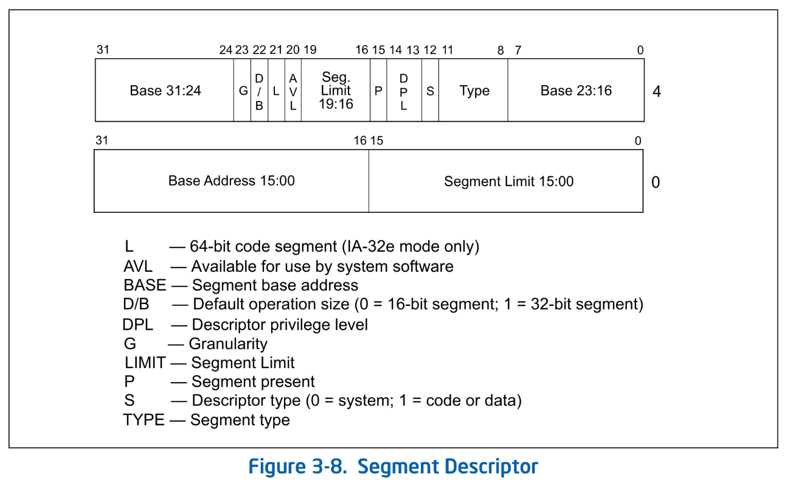

# GDT: Global Descriptor Table

このチャプターから数回にかけて、UEFI が用意してくれた構造を Ymir のものに置き換えていきます。
その第1弾が GDT です。

## Table of Contents

<!-- toc -->

## GDT の概要

**GDT: Global Descriptor Table** は、セグメンテーションの設定をする構造です[^ldt]。
セグメンテーションは、メモリをいくつかの仮想的なブロックに分割する機能です。
x86/64 ではアドレスには3つの種類があり、以下のように変換されます:

```mermaid
graph TD
    Logi[Logical Address] --> |GDT / Segment Selector| Lin[Linear Address]
    Lin --> |Page Table| Phy[Physical Address]
```

**Logical Address** はソフトウェアが直接扱うアドレスです。
**Linear Address** は Logical Address に対してセグメンテーションを適用したアドレスです。
**Physical Address** は Linear Address に対して
**MMU: Memory Management Unit** がページテーブルによる変換をしたアドレスです。

ページテーブルについては [Surtr の簡易ページテーブル](../bootloader/simple_pg.md) で既に実装済みです。
本チャプターでは Logical to Linear の変換を行う GDT の設定をします。

## Linear Address と Segment Selector

Linear Address は 32bit のアドレス (`0` - `0xFFFFFFFF`) です[^phys-space]。
Logical to Linear 変換には GDT というテーブルと **Segment Selector** が使われます。
GDT と Segment Selector の2つから、そのセグメントの *Base* / *Limit* / *Access Right* などを取得することができます。


*Logical Address to Linear Address Translation. SDM Vol.3A 3.4*

変換は以下の手順で行われます:

1. **Segment Register** から Segment Selector を取得。
2. Segment Selector が指す GDT のエントリを取得。
3. 取得した GDT エントリから **Base** を取得し、Logical Address のオフセット部に加算し、64bit Linear Address を計算。

### Segment Register

x64 の Segment Register は **CS** / **SS** / **DS** / **ES** / **FS** / **GS** の6つがあります。
各レジスタは **Segment Selector** と **Hidden Part** から成ります:


*Segment Registers. SDM Vol.3A 3.4.3*

Segment Selector は、GDT のエントリを指すインデックスです。
このインデックスをもとにして GDT が取得され、そのエントリの *Base* から Linear Address が取得されます。
Hidden Part は、selector が指す GDT のエントリの一部をキャッシュします。
解決時の際には Hidden Part に GDT の中身がキャッシュされているため、
CPU は GDT からエントリを取得する必要がなくなります[^hidden-cache]。

プログラムから直接設定できるのは selector のみです。
プログラムが selector を設定すると、CPU が自動的に GDT からエントリを取得し、Hidden Part にキャッシュします。

> [!NOTE] セグメントとアクセスチェック
> Logical to Linear 変換の際には、アドレスの計算以外にも以下のチェックが行われます:
>
> - Logical Address のオフセット部が *Limit* を超えていないか
> - セグメントの *Access Right* が適切か

### Global Descriptor Table

GDT は各セグメントの定義をするテーブルです。
Linear to Physical 変換における *Page Table* に相当する概念です。
GDT エントリは 64bit で以下の構造をしています:


*Segment Descriptor. SDM Vol.3A 3.4.5*

GDT エントリは各セグメントに対して以下の主な情報を定義します:

- *Base*: セグメントの開始 Linear Address
- *Limit*: セグメントのサイズ。*Granularity* によって単位が変わる
- *DPL: Descriptor Privilege Level*: セグメントの特権レベル。CPL が DPL 以下でないとアクセスできない。

GDT 自体のアドレスは **GDTR: GDT Register** に格納されています。
サイズは可変であり、サイズ情報も GDTR に格納されています。

### Privilege Level

CPU が持つ権限レベルは [Ring (Protection Ring)](https://en.wikipedia.org/wiki/Protection_ring) と呼ばれたりもします。
*Ring* は時折複数の異なる概念として扱われることもありますが、基本的には **CPL: Current Privilege Level** のことを指す場合が多いです。

*CPL* は CS レジスタの下位 2bit で表され、`0` - `3` の値を取ります。
Logical to Linear 変換の際には、*CPL* が変換に利用するセグメントの *DPL* 以下であるか(権限が強いか)どうかがチェックされます。
その他にも、CPL(Ring) は特権レジスタや特権命令の実行ができるかどうかの判断にも使われます。
例として [Control Register](https://wiki.osdev.org/CPU_Registers_x86-64#Control_Registers) には Ring-0 でないとアクセスできません。

> [!NOTE] IOPL
> x64 には CPL とは別に **IOPL: I/O Privilege Level** があります。
> IOPL は I/O 命令の実行に必要な CPL を定義します。
> CPL が CS レジスタに格納されているのに対し、IOPL は RFLAGS レジスタに格納されています。
> IOPL は Ring-0 の場合に限り POPF か IRET 命令のいずれかでのみ変更できます。

## 64bit モードのセグメンテーション

ここまでセグメントについて説明してきましたが、x64 ではセグメンテーションの機能のほとんどはHW的に無効化されています。
厳密には、Intel64 (x64) アーキテクチャの [64bit mode (IA-32e mode の 64bit mode)](https://ja.wikipedia.org/wiki/X64) においてはセグメンテーションはほぼ無効化されています。
*Base* は `0` として解釈され、*Limit* によるチェックは行われません。
よって、Logical to Linear 変換では実際にはアドレスの変換は行われず、フラットで巨大な1つのセグメントが使われているものとして扱われます[^virt]。

例外は *FS* と *GS* セグメントです。
この2つに対しては依然としてセグメンテーションをすることができ、どのように利用するかはソフトウェア依存です。
[glibc](https://www.gnu.org/software/libc/) においては FS は **TLS: Thread Local Storage** を表現するのに使われます。
Linux Kernel においては、GS は per-CPU データを表現するのに使われます。

なお、FS/GS を使う場合にも実際に利用されるのは *Base* 部分のみです[^limit]。
それも FS/GS の Segment Selector (Segment Register) に書き込む方法に加え、
**FSBASE** / **GSBASE** という MSR に *Base* を書き込むことで設定することもできます。
FS/GS の Hidden Part の一部は *FSBASE* / *GSBASE* にマップされています。
ちなみに、MSR への書き込み ([WRMSR](https://www.felixcloutier.com/x86/wrmsr)) は特権命令であるため context switch を伴います。
そのため Ivy Bridge からは [FSGSBASE](https://www.intel.com/content/www/us/en/developer/articles/technical/software-security-guidance/best-practices/guidance-enabling-fsgsbase.html) という拡張機能が実装され、ユーザランドから直接 *FSBASE* にアクセスできるようになりました ([RDFSBASE / RDGSBASE](https://www.felixcloutier.com/x86/rdfsbase:rdgsbase))。

> [!WARN] 64bit mode における権限チェック
> セグメンテーションが無効化されると書きましたが、これはアドレス変換が行われないという意味です。
> 64bit mode においてもセグメントへのアクセス権限チェックは行われます。
>
> 権限チェックは、CPL/DPL/RPL の3つの値をもとに行われます。
> この辺は少し複雑なため、気になる人は *SDM Vol.3A 5.5: PRIVILEGE LEVELS* を参照してください。

## Ymir のセグメンテーション

Ymir では2種類のセグメントしか設定しません。
CS とそれ以外の2つです。
Linux と異なり、GS も現在は使う予定がありません。
この2つのセグメントを GDT に設定していきましょう。

### 基本構造の定義

TODO

```ymir/arch/x86/gdt.zig
pub const SegmentDescriptor = packed struct(u64) {
    /// Lower 16 bits of the segment limit.
    limit_low: u16,
    /// Lower 24 bits of the base address.
    base_low: u24,
    /// Segment is accessed.
    accessed: bool = true,
    /// Readable / Writable.
    rw: bool,
    /// Direction / Conforming.
    dc: bool,
    /// Executable.
    executable: bool,
    /// Descriptor type.
    desc_type: DescriptorType,
    /// Descriptor Privilege Level.
    dpl: u2,
    /// Segment present.
    present: bool = true,
    /// Upper 4 bits of the segment limit.
    limit_high: u4,
    /// Available for use by system software.
    avl: u1 = 0,
    /// 64-bit code segment.
    long: bool,
    /// Size flag.
    db: u1,
    /// Granularity.
    granularity: Granularity,
    /// Upper 8 bits of the base address.
    base_high: u8,
};

pub const DescriptorType = enum(u1) {
    system = 0,
    code_data = 1,
};

pub const Granularity = enum(u1) {
    byte = 0,
    kbyte = 1,
};
```

### Null Descriptor

TODO

[^ldt]: 同様にセグメントを設定する構造に **LDT: Local Descriptor Table** がありますが、Ymir では GDT のみを使います。
[^phys-space]: x64 (Intel64) における物理アドレス空間のサイズは実装依存です。
CPUID `0x80000008` で実際のサイズを取得できます。
最近の CPU だと 46bit の場合が多いと思います。
[^hidden-cache]: Page Table を使ったアドレス変換における、**TLB: Translation Lookaside Buffer** と似たような感じですね。
[^virt]: Logical to Linear 変換が行われないため、本シリーズでは Logical/Linear Address のことをまとめて仮想アドレスと呼びます。
